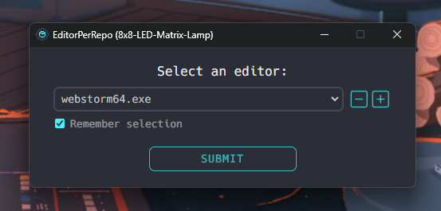

<h1>EditorPerRepo 📦</h1>
 
<h3>Open a different editor for each repo when using GitHub Desktop's editor integration feature!</h4>

  

.𖥔 ݁ ˖ ✦ ‧₊˚ ⋅

&nbsp;&nbsp;
&nbsp;&nbsp;

&nbsp;&nbsp;

[//]: # (![GitHub repo file or directory count]&#40;https://img.shields.io/github/directory-file-count/rynstwrt/CSS-Animations?type=file&style=for-the-badge&color=%2328b3b5&#41;&nbsp;&nbsp;)

[//]: # (![GitHub Issues or Pull Requests]&#40;https://img.shields.io/github/issues/rynstwrt/EditorPerRepo?style=for-the-badge&color=%23f765af&#41;)

[//]: # ()
[//]: # (![GitHub Downloads &#40;all assets, all releases&#41;]&#40;https://img.shields.io/github/downloads/rynstwrt/Pixelblaze-Desktop/total?style=for-the-badge&color=%23FF6600&#41;&nbsp;&nbsp;)

## [ FEATURES ]
- Feature
- List
- Coming
- Soon

## [ SCREENSHOTS ]

## [ INSTALLATION ]
(Coming soon)

## [ USAGE ]
(Coming soon)

