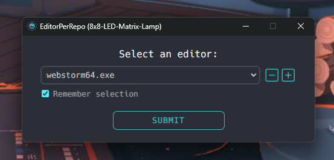

# EditorPerRepo 📦

Open a different editor assigned to each repo when using GitHub Desktop's editor integration!

.𖥔 ݁ ˖ ✦ ‧₊˚ ⋅

[//]: # (![EditorPerRepo logo]&#40;assets/icons/epr/epr.png&#41;)

 

## Features:
(Coming soon)

 

## Installation:
(Coming soon)

 

## Usage:
(Coming soon)
